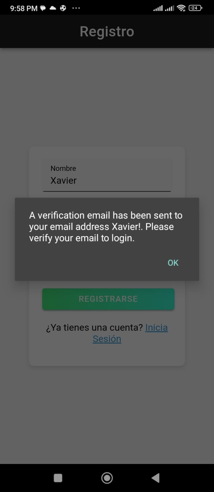
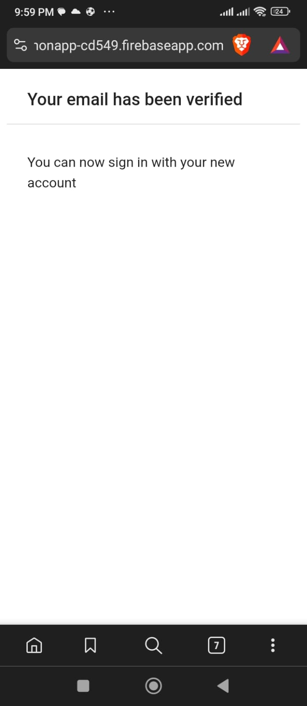
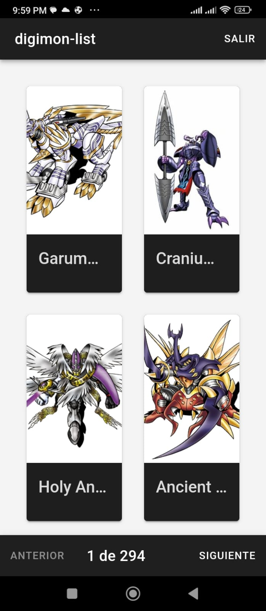

# Digimons App

Este proyecto es una aplicación de ejemplo de Ionic para mostrar una lista de Digimons y proporcionar información detallada sobre cada uno de ellos a través de un modal.

## Funcionalidades

- Lista de Digimons con cards interactivos.
- Modal con información detallada sobre cada Digimon.
- Consumo de datos de un servicio web (API de Digimons).
- Autenticación de usuarios a través de un servicio de Firebase.

## Requisitos previos

- Node.js versión 20.11.1
- Android JDK 14.0

## Instalación

1. Clona este repositorio en tu máquina local:

   ```bash
   git clone https://github.com/tuusuario/digimons-app.git
   
2. Navega hasta el directorio del proyecto:

   ```bash
   cd digimons-app

3. Instala las dependencias del proyecto:

   ```bash
   npm install
   
## Uso web

Inicia la aplicación en tu navegador web:

   ```bash
   ionic serve
   ```

La aplicación se abrirá automáticamente en tu navegador predeterminado.  

## Generar APK

Recomiendo usar la extension de ionic en Visual Studio Code, a continuación están los pasos para generar el apk por comandos:

1. Primero verficiar la generacion del proyecto con angular

   ```bash
   ng builder
   ```

2. Ejecuta copiar y luego actualizar.

   ```bash
   npx cap sync --inline
   ```

3. Construir en modo producción y copiar a las diferentes plataformas

   ```bash
   npx ng build  --configuration=production
   npx cap copy
   ```
4. Abrir el proyecto de android studio, suele ser mas familiar cuando ya se ha trabajado en entornos nativos, configurando y generando el instalador con o sin firma.  

   ```bash
   npx cap open android
   ```


La aplicación se abrirá automáticamente en tu navegador predeterminado.  

## Tecnologías utilizadas

- Ionic Framework
- Angular
- TypeScript
- HTML
- CSS

## Dependencias

- @angular/animations: ^17.0.2
- @angular/common: ^17.0.2
- @angular/compiler: ^17.0.2
- @angular/core: ^17.0.2
- @angular/fire: ^17.0.1
- @angular/forms: ^17.0.2
- @angular/platform-browser: ^17.0.2
- @angular/platform-browser-dynamic: ^17.0.2
- @angular/router: ^17.0.2
- @capacitor/app: 5.0.7
- @capacitor/core: 5.7.4
- @capacitor/haptics: 5.0.7
- @capacitor/keyboard: 5.0.8
- @capacitor/status-bar: 5.0.7
- @ionic/angular: ^7.0.0
- ionicons: ^7.0.0
- rxjs: ~7.8.0
- tslib: ^2.3.0
- zone.js: ~0.14.2

## Ejemplo de Uso

A continuación se presentan capturas de pantalla tomadas desde un dispositivo Android en el que se instaló la última versión del código fuente. Cada captura ilustra un paso específico del flujo de la aplicación:

1. Usuario no registrado

   
- Esta captura muestra la pantalla inicial de la aplicación para un usuario que aún no ha registrado una cuenta.

2. Registro de usuario

  
- En esta pantalla, el usuario completa el formulario de registro proporcionando la información necesaria, como nombre de usuario, correo electrónico y contraseña.

3. Intento de ingresar sin validar correo

  
-   La captura muestra el mensaje de error que aparece cuando un usuario intenta acceder a la aplicación antes de confirmar su dirección de correo electrónico.

4. Recepción del correo de verificación

  
- Se muestra la bandeja de entrada del correo electrónico del usuario, donde se ha recibido un mensaje de verificación de la aplicación.

5. Verificación de correo exitosa

  
- La captura muestra la pantalla de la aplicación después de que el usuario ha hecho clic en el enlace de verificación en el correo electrónico, confirmando con éxito su dirección de correo electrónico.  

6. Listado de Digimons

  
- Aquí se muestra la lista de Digimons disponibles en la aplicación, que el usuario puede explorar.

7. Detalles de un Digimon
  
- La captura muestra la pantalla de detalles de un Digimon específico, donde se proporciona información detallada sobre ese Digimon en particular.

