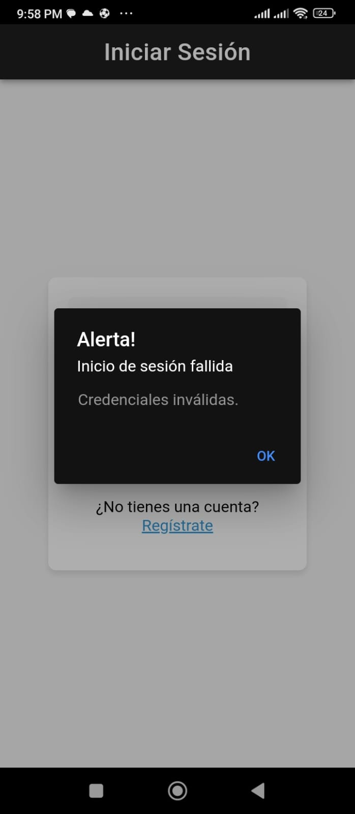
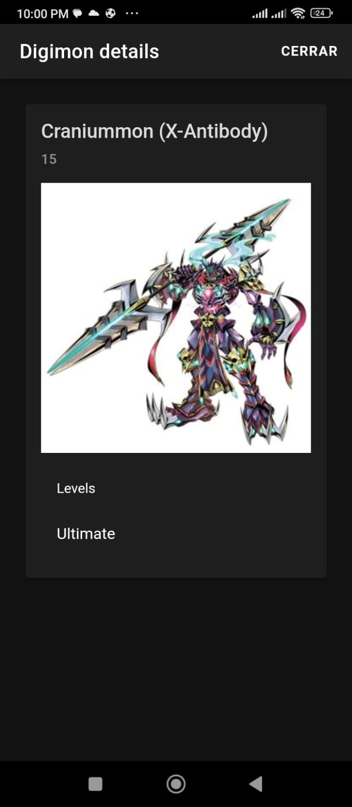

# Digimons App

Este proyecto es una aplicación de ejemplo de Ionic para mostrar una lista de Digimons y proporcionar información detallada sobre cada uno de ellos a través de un modal.

## Funcionalidades

- Lista de Digimons con cards interactivos.
- Modal con información detallada sobre cada Digimon.
- Consumo de datos de un servicio web (API de Digimons).
- Autenticación de usuarios a través de un servicio de Firebase.

## Requisitos previos

- Node.js versión 20.11.1
- Android JDK 14.0

## Instalación

1. Clona este repositorio en tu máquina local:

   ```bash
   git clone https://github.com/tuusuario/digimons-app.git
   
2. Navega hasta el directorio del proyecto:

   ```bash
   cd digimons-app

3. Instala las dependencias del proyecto:

   ```bash
   npm install
   
## Uso web

Inicia la aplicación en tu navegador web:

   ```bash
   ionic serve
   ```

La aplicación se abrirá automáticamente en tu navegador predeterminado.  

## Generar APK

Recomiendo usar la extension de ionic en Visual Studio Code, a continuación están los pasos para generar el apk por comandos:

1. Primero verficiar la generacion del proyecto con angular

   ```bash
   ng builder
   ```

2. Ejecuta copiar y luego actualizar.

   ```bash
   npx cap sync --inline
   ```

3. Construir en modo producción y copiar a las diferentes plataformas

   ```bash
   npx ng build  --configuration=production
   npx cap copy
   ```
4. Abrir el proyecto de android studio, suele ser mas familiar cuando ya se ha trabajado en entornos nativos, configurando y generando el instalador con o sin firma.  

   ```bash
   npx cap open android
   ```


La aplicación se abrirá automáticamente en tu navegador predeterminado.  

## Tecnologías utilizadas

- Ionic Framework
- Angular
- TypeScript
- HTML
- CSS

## Dependencias

- @angular/animations: ^17.0.2
- @angular/common: ^17.0.2
- @angular/compiler: ^17.0.2
- @angular/core: ^17.0.2
- @angular/fire: ^17.0.1
- @angular/forms: ^17.0.2
- @angular/platform-browser: ^17.0.2
- @angular/platform-browser-dynamic: ^17.0.2
- @angular/router: ^17.0.2
- @capacitor/app: 5.0.7
- @capacitor/core: 5.7.4
- @capacitor/haptics: 5.0.7
- @capacitor/keyboard: 5.0.8
- @capacitor/status-bar: 5.0.7
- @ionic/angular: ^7.0.0
- ionicons: ^7.0.0
- rxjs: ~7.8.0
- tslib: ^2.3.0
- zone.js: ~0.14.2

## Ejemplo de Uso

Las siguientes capturas fueran tomadas desde la version web y con un emulador, este es un método mas rápido para ejecutar y probar las funciones, con la limitante de funciones nativas.

- Usuario no registrado
  

- Registrar usuario
- 

- Intentar ingresar sin validar correo
- 

- Recepción del correo de verificación
- 

- Verificación de correo exitosa
- 

- Listado de digimons
- 

- Detalles de un digimon
- 

